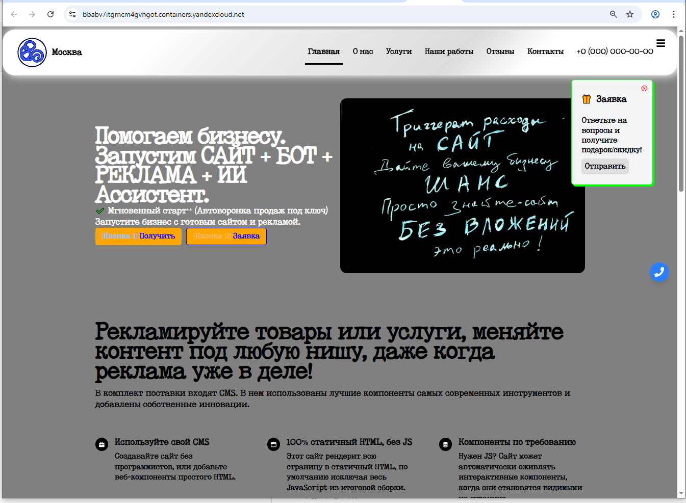

# E-commerce & Web Templates – High Performance Focus ⚡
## Online Store (Storefront)



## CMS for Online Store


- **EXAMPLE CLIENT (BASE):** [Open](https://bbabv7itgrncm4gvhgot.containers.yandexcloud.net)
- **EXAMPLE ADMIN CLIENT:** [Open](https://bban9brl7081u3mtsdp8.containers.yandexcloud.net)
  - **Login:** `admin@storelike.ru`
  - **Password:** `d%QlE@6XFZTMX~Kw$A`

**Maximum performance, minimalist design.**

This repository is a collection of highly optimized website and e-commerce templates built with a single goal: **Pagespeed 100%** on both mobile and desktop. Our templates are ready for immediate ad campaigns on Google Ads and fully optimized for SEO.

### ✨ Key Features

* **Pagespeed 100%:** Templates are built with minimal HTML/CSS/JS and modern best practices to achieve perfect performance scores.
* **Minimalistic Design:** Clean, functional design that converts visitors without distracting them.
* **SEO-Ready:** Full semantic markup, correct meta tags, and indexing-ready structure.
* **Ad-Ready:** Code and structure ready for advertising pixel integration and analytics systems.

### 🛠 Tech Stack

The project uses modern tools to ensure maximum speed:

* **Runtime:** Node.js (v22+)
* **Framework:** Astro (for fast builds and minimal JS)
* **UI Library:** React (v19+) with React Router (v7+)
* **Deployment:** Docker

### 🚀 Getting Started

You need **Node.js 22+** and **npm/yarn** for local development.

1. **Clone the repository:**
   ```bash
   git clone https://github.com/storelike/open-source-storelike-ui.git
   cd open-source-storelike-ui
   ```
2. **Install dependencies:**
   ```bash
   npm install
   # or yarn install
   ```
3. **Start development server:**
   ```bash
   npm run dev
   # or yarn dev
   ```

### 📦 Template Structure

All templates are in the `ecommerce-templates/` folder. To view or modify a specific template (e.g. `glow-store`), navigate to its directory.

### 🤝 Contributing

We welcome developers and designers who share our passion for performance.

Please read the full guide: **[CONTRIBUTING.md](./CONTRIBUTING.md)**

* **Important:** All new templates or significant changes must pass Pagespeed audit (Desktop & Mobile) with a score of **100**.

### 📄 License

This project is licensed under **[LICENSE](./LICENSE)**.
