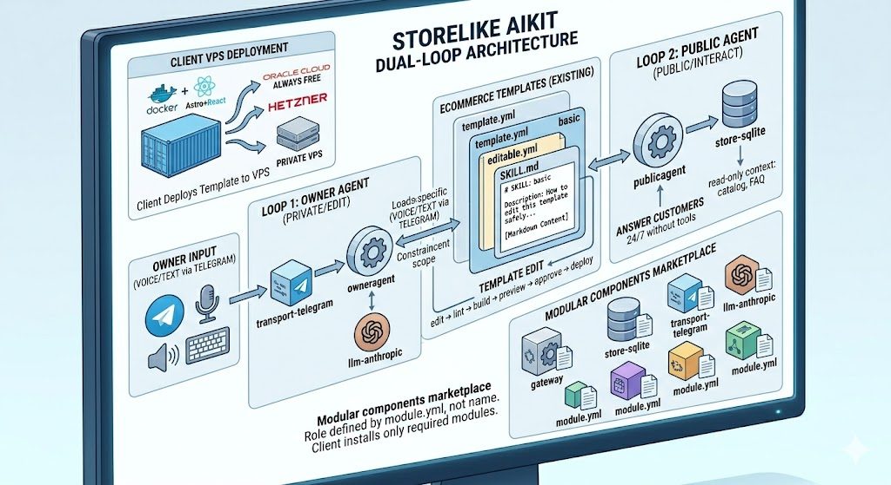

# E-commerce & Web Templates – High Performance Focus ⚡
## Online Store (Storefront)




**Maximum performance, minimalist design. AI-editable via config files.**

Storelike AIKit is a modular platform of highly optimized e-commerce templates built with a single goal: **Pagespeed 100%** on both mobile and desktop. Templates are configured by editing `cms-locale.json` — no separate admin panel needed. An AI agent can apply changes via text or voice commands through Telegram.

Our templates are ready for immediate ad campaigns on Google Ads and fully optimized for SEO.

### ✨ Key Features

* **Pagespeed 100%:** Templates are built with minimal HTML/CSS/JS and modern best practices to achieve perfect performance scores.
* **Minimalistic Design:** Clean, functional design that converts visitors without distracting them.
* **SEO-Ready:** Full semantic markup, correct meta tags, and indexing-ready structure.
* **Ad-Ready:** Code and structure ready for advertising pixel integration and analytics systems.

### 🛠 Tech Stack

The project uses modern tools to ensure maximum speed:

* **Runtime:** Node.js (v22+)
* **Framework:** Astro (for fast builds and minimal JS)
* **UI Library:** React (v19+) with React Router (v7+)
* **Deployment:** Docker

### 🚀 Getting Started

The platform is modular — each template and each module is installed independently. You need **Node.js 22+** and **Docker** for local development.

1. **Clone the repository:**
   ```bash
   git clone https://github.com/storelike/aikit.git
   cd aikit
   ```

2. **Run a template** (e.g. `basic`):
   ```bash
   cd ecommerce-templates/basic
   npm install
   npm run dev          # dev server at http://localhost:4321
   ```

3. **Build for production:**
   ```bash
   npm run build        # astro check + astro build
   npm run preview      # preview production build
   ```

4. **Deploy with Docker:**
   ```bash
   docker build -t storelike/basic .
   docker run -d -p 8080:8080 --env-file .env storelike/basic
   ```

5. **Generate full platform compose** (all modules):
   ```bash
   cd ../..             # back to repo root
   npm install          # install root dependencies
   node core/runtime/dist/index.js generate .
   # produces deploy/compose/docker-compose.yml
   ```

### 📦 Project Structure

**Templates** live in `ecommerce-templates/` — each is a standalone Astro project with its own `package.json` and `Dockerfile`. Pick a template, install, and run.

**Modules** live at the repo root — `publicagent/`, `owneragent/`, `store-sqlite/`, `llm-anthropic/`, `gateway/`, `transport-telegram/`, `auth-totp/`, `voice/`, etc. Each module has a `module.yml` manifest. Install only what you need.

**Core** (`core/`) contains contracts (Zod schemas), runtime (module scanner, dependency resolver, compose generator), and security (editable-checker, secrets guard).

**Docs** (`docs/`) — [SECURITY.md](docs/SECURITY.md), [THREAT-MODEL.md](docs/THREAT-MODEL.md), [AI-EDIT-SAFETY.md](docs/AI-EDIT-SAFETY.md), [MODULE-AUTHORING.md](docs/MODULE-AUTHORING.md), [TEMPLATE-AUTHORING.md](docs/TEMPLATE-AUTHORING.md).

### 🤝 Contributing

We welcome developers and designers who share our passion for performance.

Please read the full guide: **[CONTRIBUTING.md](./CONTRIBUTING.md)**

* **Important:** All new templates or significant changes must pass Pagespeed audit (Desktop & Mobile) with a score of **100**.

### 📄 License

This project is licensed under **[LICENSE](./LICENSE)**.
